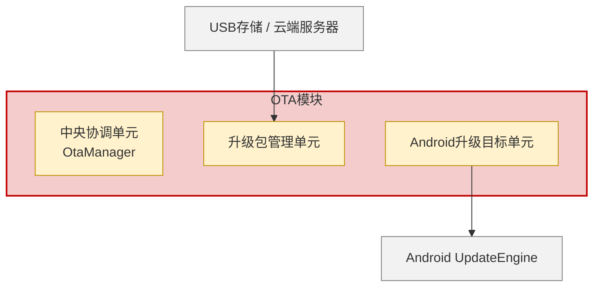
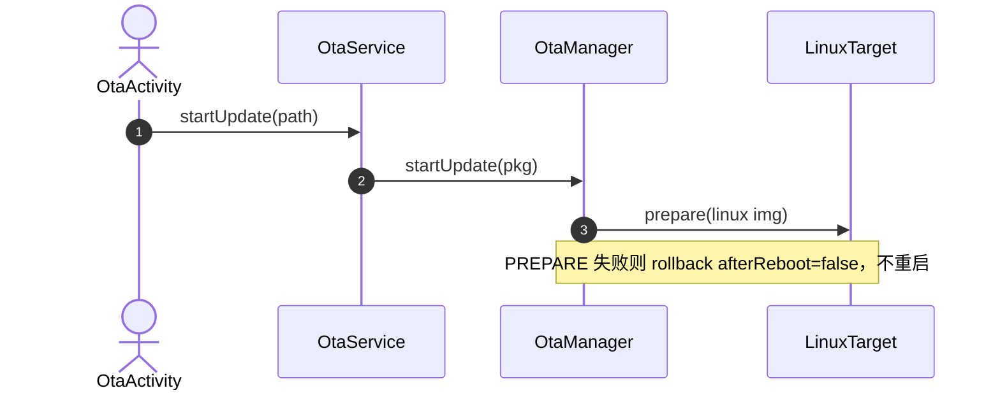
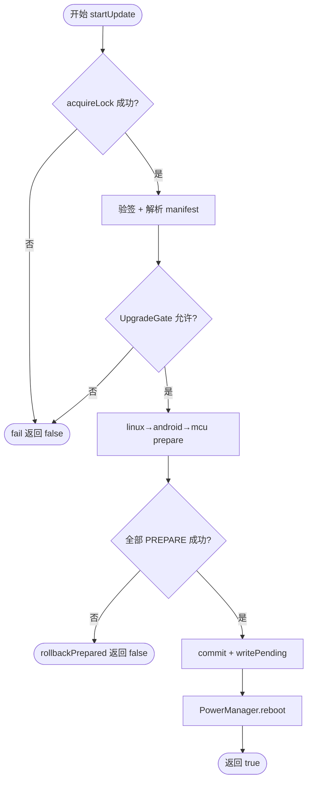

# Markdown 详设与 Mermaid 图

Word 与 Markdown **同一套章节、同一套设计事实**。Markdown 里的图只用 mermaid 代码块，不要用 ASCII 框线或外链图片代替架构/时序/流程。

## 何时画哪种图

| 模板位置 | mermaid 类型 | 说明 |
|----------|--------------|------|
| 2.1 边界关系 / 架构 | `flowchart TB` | 红=本模块，黄=单元，灰=外部；`subgraph` 包本模块 |
| 2.2.1 静态结构 | `flowchart TB` | 按代码分层，一层一个 subgraph |
| 2.2.2 动态行为 | `sequenceDiagram` | 消息序号与后文①②表一致；可 `autonumber` |
| 2.3 复杂函数 | `flowchart TD` | 菱形判定，`是`/`否` 分支，必须有失败路径 |
| 状态机（若代码有明确枚举） | `stateDiagram-v2` | 状态名用代码枚举字面量 |

每种图上方写一句图题：`**图2-1 OTA模块边界关系图**`。

## 语法约束（避免渲染失败）

- 节点 ID 只用 `[A-Za-z][A-Za-z0-9_]*`，中文放在 `["标签"]` 里
- `subgraph` 标题加引号：`subgraph MOD["OTA模块"]`
- 不要在标签里写未转义的 `()` `[]` `{}` `|`；必要时改成顿号或全角括号
- 参与者别名：`participant OM as OtaManager`
- 一行一个语句；不要把中文冒号写成 mermaid 的 `:` 边语法冲突（边用 `-->`，不要 `A--中文-->B` 里夹未加引号的特殊符号）
- 配色用 `classDef` + `class`，不要依赖 HTML

## 配色（与 V1.0.2 模板【模板说明】一致）

```mermaid
flowchart TB
  classDef module fill:#F4CCCC,stroke:#C00000,stroke-width:2px,color:#000
  classDef unit fill:#FFF2CC,stroke:#BF9000,stroke-width:1px,color:#000
  classDef ext fill:#F2F2F2,stroke:#7F7F7F,stroke-width:1px,color:#000
```

## 示例：边界 / 架构



## 示例：时序



## 示例：程序流程（含失败分支）



判定节点用 `{问题?}`，成功走「是」、失败走「否」到明确终止节点。禁止只有一条竖线、没有分支的假流程。

## Markdown 文件骨架

章节标题与 Word **同一套**（V1.0.2 见 citc-sdd-v1.0.2.md）。文首 YAML：

```yaml
---
title: G200Z软件详细设计报告_OTA模块
version: V1.0.0
date: 2026-08-18
source_code:
  - mos-android/packages/apps/MosOTA
template: xxx软件详细设计报告_xxx模块_Vx.x.x（模板版本V1.0.2）.docx
---
```

表用 GitHub 管道表。函数说明表用 7 行两列（标签 | 内容）。不要写【模板说明】【示例】。

## 与 Word 插图同步

Markdown 是图的**源**。生成 Word 用的 PNG 时：

1. 把每个 mermaid 块另存为 `/tmp/sdd_<模块>/fig_*.mmd`
2. 若有 `mmdc`：`mmdc -i fig.mmd -o fig.png -b transparent -s 2`
3. 否则按同一结构用 PIL 重画（节点/边不得比 mermaid 多或少）

不要维护两套互相矛盾的图。
