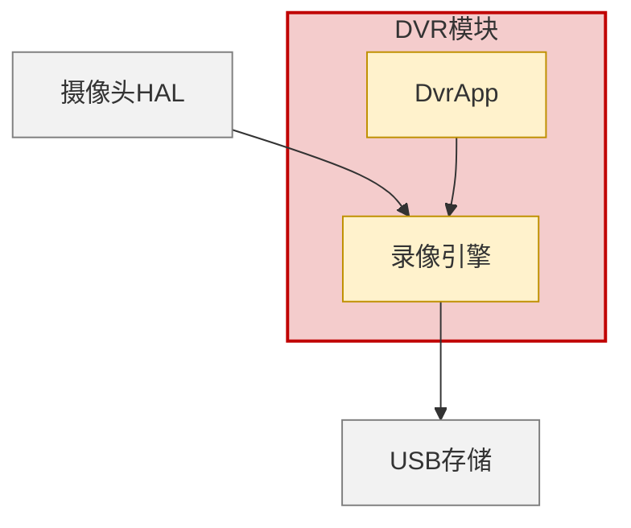
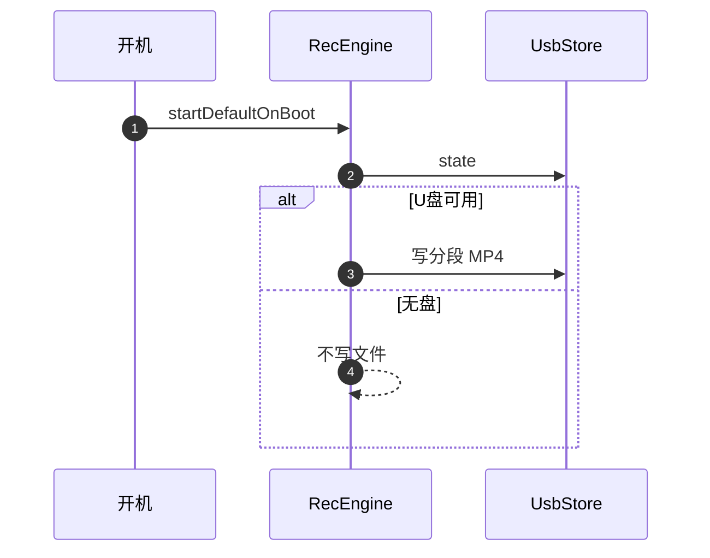

# Markdown 概设与 Mermaid 图

Word 与 Markdown **同一套章节、同一套设计事实**。图只用 mermaid 围栏。

## 何时画哪种图

| 模板位置 | mermaid 类型 | 说明 |
|----------|--------------|------|
| 2.2 上下文 / 边界 | `flowchart TB` | 红=本模块，黄=内部单元，灰=外部 |
| 2.3 逻辑架构 | `flowchart TB` | 按代码分层，一层一个 subgraph |
| 3.1 模块依赖 | `flowchart TB` | 被依赖者在上 |
| 6 主路径 | `sequenceDiagram` | 可 `autonumber`；与后文①②一致 |
| 状态机（代码有枚举） | `stateDiagram-v2` | 状态名用代码字面量 |
| **不要** | 函数级 `flowchart TD` | 那是详设 |

每种图上方：`**图2-1 …模块上下文图**`。

## 语法约束

- 节点 ID：`[A-Za-z][A-Za-z0-9_]*`，中文放 `["标签"]`
- `subgraph MOD["OTA模块"]`
- 标签内避免未转义的 `()` `[]` `{}` `|`
- `participant OM as OtaManager`
- 配色用 `classDef` + `class`

架构图**没有**判定节点时，不要为了 lint 硬加「是/否」。

## 配色

```mermaid
flowchart TB
  classDef module fill:#F4CCCC,stroke:#C00000,stroke-width:2px,color:#000
  classDef unit fill:#FFF2CC,stroke:#BF9000,stroke-width:1px,color:#000
  classDef ext fill:#F2F2F2,stroke:#7F7F7F,stroke-width:1px,color:#000
```

## 示例：上下文



## 示例：时序



## Markdown 文首

```yaml
---
title: G200Z软件概要设计报告_DVR模块
version: V1.0.0
date: 2026-08-18
source_code:
  - path/to/module
template: xxx软件概要设计报告_xxx模块.docx 或 templates/default.md
---
```

表用 GitHub 管道表。不要写【模板说明】【示例】。不要用 `MarkdownBuilder.func_spec`（那是详设）。

## 与 Word 插图同步

1. 每个 mermaid 另存 `/tmp/hld_<模块>/fig_*.mmd`
2. 有 `mmdc`：`mmdc -i fig.mmd -o fig.png -b white -s 2`
3. 否则 PIL 按同一节点/边重画

不要维护两套互相矛盾的图。
