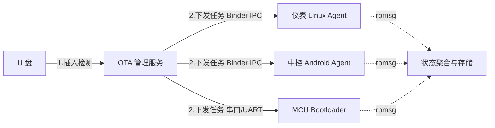
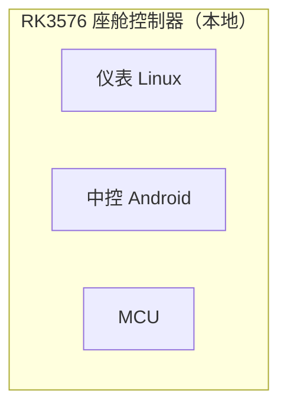
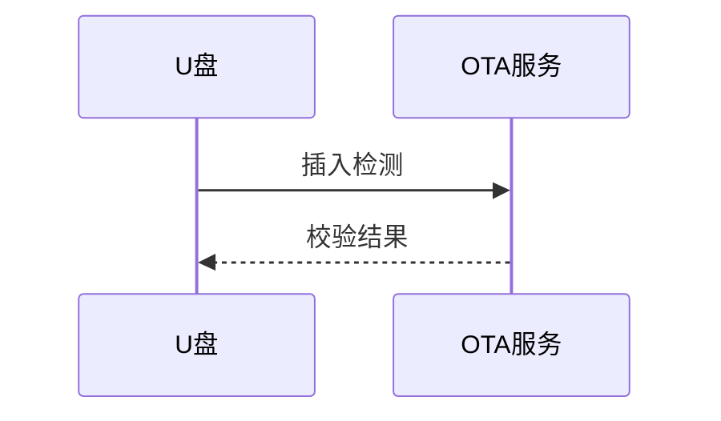

# Mermaid 快速迭代指南

当用户更看重**逻辑结构、文本驱动、易改**，而非像素级还原时，用 Mermaid。
优点：源码即图、diff 友好、可嵌入 Markdown/Notion/GitHub。
缺点：布局自动、难以精确复刻原图排版、嵌套容器与图例支持弱。

## 选型建议

- 纯流程/时序/状态机 → Mermaid 很合适。
- 多层嵌套容器、精确坐标、复杂图例、演示级美观 → 用 HTML+SVG（见 html_svg_guide.md）。

## 常用图型

### 流程图（架构/数据流）

### 用 subgraph 表达分组容器

### 时序图（交互时序）

## 语义映射（与原图对齐）

| 原图 | Mermaid |
| --- | --- |
| 实线箭头 | `-->` |
| 虚线箭头（预留/状态） | `-.->` 或 `-.文字.->` |
| 带标签 | `-->|标签|` |
| 分组容器 | `subgraph ... end` |
| 节点配色 | `style N fill:#eff6ff,stroke:#2563eb` |

## 交付

- 保存为 `.mmd` 源码文件一并交付（用户可再编辑）。
- 需要预览图时，用 mermaid-cli：
  `npx -y @mermaid-js/mermaid-cli -i diagram.mmd -o diagram.png`
  （无网络/无 node 时，仅交付源码，说明可在 https://mermaid.live 预览。）
