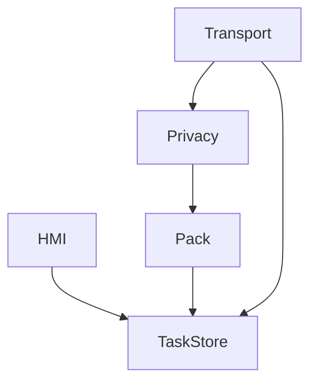

# 样例：从一句 PRD 到 FR 再到设计（节选）

完整可跑的测试 PRD 见仓库 `test/prd-to-design/inputs/`。默认骨架在 `templates/default/`；车机用 `templates/ivi/`。这里只展示**质量标尺**，不要当唯一业务模板。

## 输入（PRD 原句）

> 司机可一键把最近的诊断日志发到云端。弱网也要能传。注意隐私。协议后续再定。

## 功能需求（正确方向）

| ID | 模块 | 功能名称 | 优先级 | 来源 |
| --- | --- | --- | --- | --- |
| FR-TRIG-01 | 触发 | 一键发起上报 | P0 | PRD「一键」 |
| FR-PACK-01 | 采集打包 | 收集最近诊断日志并打包 | P0 | PRD「最近的诊断日志」 |
| FR-PRIV-01 | 脱敏 | 上报前去掉标识与位置等敏感字段 | P0 | PRD「注意隐私」；字段清单 OPEN |
| FR-UPLD-01 | 传输 | 将数据包发到云端并得到明确结果 | P0 | PRD「发到云端」 |
| FR-UPLD-02 | 传输 | 失败可重试，弱网不丢已排队任务 | P0 | 推导，依据 NFR-NET-01 |
| NFR-NET-01 | — | 弱网可恢复传输 | P0 | PRD「弱网也要能传」 |
| OPEN-01 | — | 上传协议 / 云端地址 / 鉴权未定 | 阻塞 FR-UPLD-01 | PRD「协议后续再定」 |

**FR-UPLD-01 验收（合格写法）：**

1. 给定已打包且脱敏完成的文件，当传输成功，则 HMI 显示成功，本地任务状态为 `SUCCESS`。
2. 给定云端 5xx 或超时，当本次尝试失败，则状态为 `FAILED` 或 `QUEUED`（与重试策略一致），用户能看到失败原因类别，而不是无限转圈。

**不合格：**「上传要稳定、体验好。」

## 概要设计（正确方向）

开发顺序：`本地任务存储` → `采集打包` → `脱敏` → `传输（协议适配层）` → `HMI`。

传输模块只依赖「包文件 + 任务 ID + 目标配置」，协议用适配层包住，`OPEN-01` 未锁定前用桩。不要先画「云端微服务全景」。

## 反例

- 把「一键上报」写成一条 FR，验收只有「用户可以上报」。
- 概要设计按 PRD 章节写「产品价值 / 竞品 / 运营活动」，没有模块依赖。
- 协议未定却直接规定了某云厂商完整 API 当既成事实。
- 设计里突然多了「实时对讲」，功能需求表没有。
